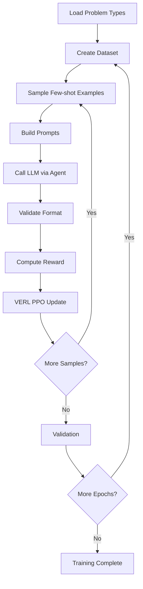

# 🎯 Strategy Extraction Training - Stage 1 Complete!

## ✅ Implementation Status: COMPLETE

All components have been successfully implemented for the first stage of your two-stage self-evolution model training pipeline.

---

## 📁 Project Structure

```
examples/strategy_extraction/
├── __init__.py                    # Package initialization
├── README.md                      # Comprehensive user documentation
├── IMPLEMENTATION_SUMMARY.md      # Technical implementation details
├── config.py                      # Configuration classes and VERL setup
├── data_loader.py                 # Data loading and smart sampling
├── prompts.py                     # System and user prompt templates
├── reward.py                      # Format reward validation
├── strategy_agent.py              # Main agent implementation
├── train_strategy.py              # Training entry point
└── test_data_loading.py           # Test script for verification
```

---

## 🚀 Quick Start

### 1. Test Your Setup

First, verify that your data paths are correct and everything loads properly:

```bash
cd /home/test/test16/chenlu/projects/agent-lightning
python examples/strategy_extraction/test_data_loading.py
```

This will:
- ✓ Load problem types from your data directory
- ✓ Test the sampling strategy
- ✓ Create a small test dataset
- ✓ Show formatted prompts
- ✓ Validate reward function

### 2. Run Training

Once tests pass, start training:

```bash
python examples/strategy_extraction/train_strategy.py \
    --data-base-path /home/test/test16/chenlu/projects/LLMReflection/data/ \
    --train-subdir train_20k \
    --val-subdir test-bbh \
    --model-path /home/test/test16/chenlu/model/Qwen3-4B \
    --fewshot-min 3 \
    --fewshot-max 8 \
    --num-train-samples 1000 \
    --num-val-samples 200 \
    --n-runners 10 

```

Todo:

1 日志：ai己经写了日志保存的逻辑，但没有实际保存，问一下为什么没保存下来（path to save）
    a 报错很有可能来源于wandb 但wandb代码可能没有修改，确定是不是日志的逻辑导致的
    b checkpoint 为什么只保存了63 64 ，是save all全save了 还是别的什么原因 
    c checkpoint能不能保存hugging face格式 就是保存safestensor
2 日志：看一下模型的raw output是否正常，据此修改一下prompt
    a token长度
    b 对策略的要求 是否给一个例子
    c 细节的内容
    d reward 只判断了策略标签是否存在，没判断是否有合理的内容，而不是作为思考内容，怎么跟精准地判断格式 粗暴的方法：判断长度，大于10token
    e 设计reward去判断策略的通用性、有效性（看看好策略的长度应该是多少）
3 测试训练
    a 检查agent逻辑 input output分别是什么 提取策略的具体细节是不是对的 fewshot是否来自同一个领域 解决的问题是否要是同领域的
    b train val 的batchsize，rollout.n，agl的配置 按需要调整
    c format 训练涨点
4 二阶段的实现 需要仔细考虑（选择agl训练阶段的实现）论文idea 
    (先学会 follow strategy，再看 follow strategy 对 correctness 的提升)
    a 已经提取好策略了（满足通用性、元学习能力）
    b 先用策略去解决同一领域的任务（从同领域例子提取策略应用去解决同领域的问题，评估效果）
    c 跨领域解决任务
    d 跨领域模式中，如何去匹配策略和问题？（随机匹配、相似度匹配、穷举组合、平衡采样）
        1）相似度匹配：基于问题相似度选择最合适的策略（需要定义相似度指标）
        2）如何计算问题相似度？
            1）使用embedding相似度（如cosine similarity）✅
            2）关键词重叠
            3）使用LLM判断相似度
            4）基于领域元数据
    e 如何判断策略一致性？
        1）关键词匹配：检查答案中是否包含策略中的关键步骤/概念
        2）结构化检查：如果策略有明确的步骤，检查答案是否按照步骤执行✅
        3）使用LLM作为Judge：让另一个模型判断答案是否遵循策略（可以利用强模型API/训练一个打分模式）
    f 答案正确性的评估方式
        1）灵活匹配：结合多种方式（exact match优先，失败则尝试其他）✅
        2）exact match：完全匹配ground truth
        3）f1 score：基于token级别的F1
        4）数值容差：对于数值答案，允许一定误差范围
    g 如何组合策略一致性和答案正确性两个reward？
        1）加权求和（需要设置权重）
        2）乘积（两者都必须高）
        3）条件式（只有策略一致性高的时候才给正确性的reward）✅
        4）分别追踪（训练中分别记录两个指标，但只用一个作为主reward）
    h 
    i 
    j 
    k 
5 用judger去评估证明具有自主学习能力的agent效果好！
    a 阅读gemini上关于rubric的四篇文章
    b qwen团队小模型CKD作judger文章
6 metric的设计
    a 思考怎么去评价证明得到的reward是通用性的、是有效的
    b 策略通用性：可能需要在多个问题上测试同一策略
    c 策略有效性：对比有无策略的答案质量

---

## 🎓 What This Stage Does

### Training Objective

**Input**: A set of example problems with their solutions (from the same problem type)

**Output**: A general, executable, and transferable problem-solving strategy wrapped in `<strategy>...</strategy>` tags

**Key Point**: The model is NOT solving specific problems yet - it's learning to extract and articulate strategies.

### Example

**Input (Few-shot examples)**:
```
Example 1:
Problem: 1 + 4 = 
Solution: 5

Example 2:
Problem: 4 + 9 = 
Solution: 13

Example 3:
Problem: 5 + 0 = 
Solution: 5
```

**Expected Output**:
```
<strategy>
To solve single-digit addition problems:
1. Identify the two numbers to be added
2. Count up from the first number by the value of the second number
3. The result is the sum of the two numbers
4. Express the answer as a single integer
</strategy>
```

---

## 🔧 Key Implementation Features

### ✅ Flexible Configuration
- All paths configurable (data, model, train/val directories)
- Adjustable few-shot range (min/max)
- Full control over dataset sizes
- LoRA support for memory efficiency

### ✅ Smart Data Sampling
- **Coverage Maximization**: Tracks used examples per problem type
- **Minimal Repetition**: Avoids reusing examples until necessary
- **Balanced Distribution**: Ensures all problem types get equal attention
- **Automatic Reset**: Intelligently resets when examples are exhausted

### ✅ Strict Format Validation
- Detects presence of opening `<strategy>` tag
- Detects presence of closing `</strategy>` tag
- Ensures non-empty content between tags
- Prevents multiple strategy blocks
- Supports multiline strategies

### ✅ Production-Ready Code
- Type hints throughout
- Comprehensive error handling
- Detailed logging at multiple levels
- Follows agent-lightning conventions
- Zero linter errors

---

## 📊 Data Structure Requirements

Your data should be organized as:

```
/path/to/data/
├── train_20k/              # Training data (name configurable)
│   ├── problem_type_1/
│   │   ├── file1.json
│   │   └── file2.json
│   ├── problem_type_2/
│   └── ...
└── val_set/                # Validation data (name configurable)
    ├── problem_type_1/
    └── ...
```

Each JSON file contains:
```json
{
    "task": "...",
    "subtask": "...",
    "examples": [
        {"input": "...", "target": ["..."]},
        {"input": "...", "target": ["..."]}
    ]
}
```

---

## 📈 Monitoring Training

### Key Metrics to Watch

1. **Format Reward Rate**: Should increase over time (target: > 0.8)
2. **Problem Type Distribution**: Should be balanced
3. **Sample Diversity**: Check logs for sampling statistics

### WandB Integration

Training automatically logs to WandB (if configured):
- Project: "StrategyExtraction"
- Experiment: "stage1"
- Metrics: reward, loss, learning rate, etc.

---

## 🐛 Troubleshooting

### "No problem types found"
→ Check your `--data-base-path` and `--train-subdir` settings

### "fewshot_max exceeds available examples"
→ Some problem types have fewer examples than requested. Reduce `--fewshot-max`

### "Reward stays at 0.0"
→ Check `--debug` logs to see format errors. Model may need more training steps

### Memory errors
→ Enable `--lora` or reduce `--n-runners` and `--num-train-samples`

### External store connection refused
→ Make sure `agl store --port 9999` is running and `AGL_MANAGED_STORE=0` is set

---

## 🔄 Training Workflow



---

## 📚 Documentation Files

1. **README.md**: User-facing documentation with usage examples
2. **IMPLEMENTATION_SUMMARY.md**: Technical implementation details
3. **THIS FILE**: Quick reference and status overview

---

## ✨ What's Next: Stage 2

After Stage 1 training completes and the model learns to extract strategies:

### Stage 2 Objective
Train the model to **apply** the extracted strategy to solve specific problems

### Changes for Stage 2
1. **Prompt**: Include both strategy AND a specific problem
2. **Reward**: Add correctness reward (not just format)
3. **Task Structure**: `{strategy, problem, ground_truth}`

### Stage 2 Flow
```
Strategy (from Stage 1) + New Problem → Solution → Correctness Reward
```

---

## 📞 Support & Questions

If you encounter issues:

1. **Run Tests First**: `python test_data_loading.py`
2. **Enable Debug Logging**: Add `--debug` flag
3. **Check Data Paths**: Verify all paths exist and are readable
4. **Review Logs**: Look for specific error messages
5. **Check GPU**: Ensure CUDA is available for VERL

---

## ✅ Pre-Flight Checklist

Before running training, verify:

- [ ] Data directory exists and contains problem type folders
- [ ] Model path is correct and model is accessible
- [ ] GPU(s) available (check with `nvidia-smi`)
- [ ] `test_data_loading.py` runs without errors
- [ ] Validation subdirectory configured correctly
- [ ] Sufficient disk space for checkpoints
- [ ] WandB configured (optional but recommended)

---

## 🎉 Success Indicators

You'll know training is working when:

1. ✅ Format reward increases from ~0.0 to >0.8
2. ✅ Model consistently produces `<strategy>...</strategy>` tags
3. ✅ Strategies become more coherent and detailed over time
4. ✅ Validation rewards match training rewards
5. ✅ No errors in logs

---

## 🏁 Ready to Train!

All components are implemented and ready. Simply:

```bash
# Test
python examples/strategy_extraction/test_data_loading.py

# Train
python examples/strategy_extraction/train_strategy.py --debug

# Monitor with WandB (visit the URL in the logs)
```

Good luck with your training! 🚀


