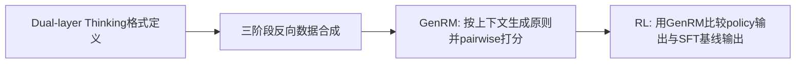

# HER论文详细拆解（arXiv:2601.21459）

> 论文：**HER: Human-like Reasoning and Reinforcement Learning for LLM Role-playing**  
> 链接：<https://arxiv.org/pdf/2601.21459>（v3，2026-02-08）

---

## 0. 先说清：这篇论文在做什么

这篇论文不是做通用 Agent 训练框架（像 Agent Lightning），而是专门做 **LLM角色扮演（role-playing）能力增强**。核心目标是：让模型不仅“像这个角色在说话”，还要“像这个角色在思考”。

---

## 1. 摘要提炼（重点：工具、agent、数据合成、算法创新）

### 1.1 摘要核心

论文指出现有 role-play 模型的两大缺口：

1. 缺高质量“推理轨迹”数据（尤其是角色内心推理）。  
2. 缺和人类偏好对齐、可靠的 reward 信号。

为此提出 HER 框架：

- **Dual-layer Thinking**：把思考分成两层：
  - `system thinking`（第三人称、隐藏规划）
  - `role thinking`（第一人称、角色内心）
- **反向合成数据**：从已有角色对话反推“思维轨迹”。
- **GenRM奖励模型**：用成对偏好判断（pairwise）作为 RL 奖励来源。
- **SFT + RL**：先监督训练，再强化学习优化。

### 1.2 摘要里的结果

相对 Qwen3-32B baseline：

- CoSER 提升 **+30.26%**（22.86 -> 53.12）
- Minimax Role-Play Bench 提升 **+14.97%**（50.76 -> 65.73）

---

## 2. 方法总览（循序渐进）

论文方法链路可以压缩为 4 步：

论文第3节原文结构也是这四块（§3.1~§3.4）。

---

## 3. Dual-layer Thinking（算法创新点1）

### 3.1 为什么需要两层thinking

论文认为 role-play 同时需要：

1. 一个隐藏规划器来跟踪角色约束和情境约束（system thinking）。
2. 可见的角色内心活动来提升“像人感”（role thinking）。

如果把两者混在一起，会导致：

- 规划能力不稳定；
- 奖励模型无法只监督“角色层思考”。

### 3.2 训练样本格式

论文给出的样本格式（Table 1）是：

- 输入：角色档案 + 场景 + 历史对话
- 输出：
  - `<system_thinking> ... </system_thinking>`（隐藏）
  - `<role_thinking> / <role_action> / speech`（可见）

这实际上是把“推理”和“表现”显式结构化了。

---

## 4. 数据合成（重点）

### 4.1 论文的核心做法：Reverse Synthesis

论文不是纯手工标注推理轨迹，而是做“反向工程”式自动合成：

- 给定已有高质量 role-play 对话（表层文本）。
- 用教师模型反推出每一轮背后的 system/role thinking。
- 形成 reasoning-augmented trajectory。

### 4.2 三阶段管线（论文Figure 1）

1. Role Thinking Augmentation  
2. System Thinking Construction  
3. Integration & Context Augmentation

这样得到可用于：

- SFT（冷启动）
- GRM训练
- Policy RL
- 评测（并做数据隔离防泄漏）

---

## 5. Reward设计（重点）

### 5.1 为什么不是“直接打分”

role-play 没有唯一标准答案，单点分数（point-wise）容易不稳、被投机特征利用。

### 5.2 GenRM（Generative Reward Model）

论文设计是 pairwise 偏好判断：

- 输入同一上下文下两个候选回复 A/B
- 输出 `cand_1 / cand_2 / tie`

关键是它不只出结果，还会生成评估轨迹（先提原则、再分维比较、再总判决）。

### 5.3 奖励映射（RL信号）

RL阶段中，policy 输出 `y` 与冻结的 SFT 基线输出 `y_sft` 比较，映射为：

- `r=+1`：`y` 胜过 `y_sft`
- `r=-1`：`y` 差于 `y_sft`
- `r=0`：平局

这是一个很工程化、稳定的 outcome-based reward 方案。

---

## 6. Prompt设计（重点）

论文在评测里强调了 **统一输出格式**（Appendix E.3）：

- thinking（对其他角色不可见）
- action（可见）
- speech（可见）

目的：

1. 跨模型公平评测。  
2. 降低格式差异对 judge 的干扰。  
3. 与 CoSER 判分 prompt 对齐。

同时，CoSER judge 使用 deduction-based rubric，并要求输出结构化 JSON（缺陷类型+严重度）。

---

## 7. Evaluation Metric设计（重点）

### 7.1 基准

1. **CoSER**（主基准）：平均分 + 四维分（SC/AN/CF/SQ）。
2. **Minimax Role-Play Bench**：100轮 self-chat，综合 Worlds/Stories/Preferences。

Minimax 总分定义（论文附录）：

\[
Overall = 0.5 \cdot Worlds + 0.25 \cdot Stories + 0.25 \cdot Preferences
\]

### 7.2 结果表（主结果）

| 模型 | CoSER Avg | Minimax Avg |
|---|---:|---:|
| Qwen3-32B baseline | 22.86 | 50.76 |
| HER-SFT | 50.92 | 58.44 |
| HER-RL | 53.12 | 65.73 |

### 7.3 关键分析结果

1. **RL在SFT之上仍有增益**：CoSER 50.9 -> 53.1。  
2. **By-case原则 + pairwise + CoT 的GRM监督最好**：人类一致率最高到 **93%**（Table 3）。  
3. **System thinking本身有效**：平均分 48.64 -> 50.92，Character Fidelity 和 Storyline Consistency 提升明显。  
4. 论文还专门讨论了 reward hacking 里的 **pattern bias**，并通过混合训练模式缓解。

---

## 8. 工具 / Agent视角解读

如果从“Agent系统”角度看，这篇论文的 Agent 其实是“角色对话体”，不是工具调用型 agent。它没有像 SQL/RAG agent 那样把工具执行轨迹作为核心对象。

所以：

- **强项**：主观偏好、角色一致性、叙事质量。  
- **弱项**：对外部工具交互、可验证任务闭环贡献较少。

---

## 9. 结论总结（论文原意）

论文结论可概括为：

1. 用 Dual-layer Thinking 可更好地定义“角色内推理”训练目标。  
2. 用反向合成可规模化构造 reasoning role-play 数据。  
3. 用原则对齐的生成式奖励模型 + RL 可显著提升 role-play 指标。  
4. 局限也明确：评测仍偏 CoSER、数据构建依赖强教师模型、仍可能存在其它 reward hacking 模式。

---

## 10. 对你项目（few-shot示例提策略→迁移求解）的启发

你说得很对：这篇论文和你项目不是同一问题设定，它的直接可迁移性 **有限**。  
但仍有 4 个可借鉴点：

1. **结构化思维层**：把“隐藏规划”和“可见策略表达”拆开，能减少训练目标混乱。  
2. **反向数据合成思路**：从已有解答反推中间策略轨迹，适合补齐 few-shot 任务中的“策略监督缺口”。  
3. **pairwise奖励比point-wise更稳**：当任务主观性高、单分值噪声大时，pairwise更实用。  
4. **防奖励投机意识**：论文对 pattern bias 的分析可直接迁移到你的策略评分器设计。

### 两句话概括这篇论文对你项目的意义

这篇论文不是“解题策略迁移”论文，但它给了你一个很有价值的方法论：**先把策略过程结构化，再用偏好式奖励稳定优化**。你可重点借鉴“反向合成中间轨迹 + pairwise奖励建模 + 反投机训练”这三块。

---

## 参考链接

- arXiv摘要页：<https://arxiv.org/abs/2601.21459>  
- arXiv PDF：<https://arxiv.org/pdf/2601.21459>  
- 作者提供代码（论文首页给出）：<https://github.com/cydu24/HER>  
- 模型（论文首页给出）：<https://huggingface.co/ChengyuDu0123/HER-32B>  
- 奖励模型（论文首页给出）：<https://huggingface.co/ChengyuDu0123/HER-RM-32B>  
- 数据集（论文首页给出）：<https://huggingface.co/datasets/ChengyuDu0123/HER-Dataset>
