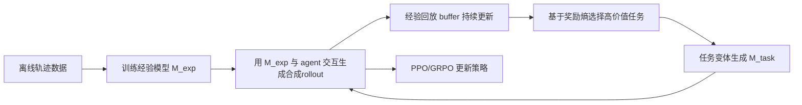

# 2026-02-27 DreamGym 论文拆解：用“经验合成”规模化训练 Agent RL

> 论文：**Scaling Agent Learning via Experience Synthesis**  
> arXiv：<https://arxiv.org/abs/2511.03773>（v2, 2025-11-10）

---

## 0. 先把结论说清楚（1分钟版）

这篇论文提出 **DreamGym**：不再依赖昂贵、慢、难并行的真实环境 rollout，而是训练一个“推理型经验模型（experience model）”来合成轨迹（状态转移+奖励），并配合经验回放与课程任务生成做在线 RL。

它的核心贡献不是“新RL算法”，而是“**把可学习经验的供给系统化、规模化**”。

---

## 1. 摘要提炼（按你要求聚焦：工具、agent、数据合成、算法创新）

### 1.1 摘要的核心矛盾

论文认为 LLM Agent 做 RL 卡在四件事：

1. rollout 采样太贵（真实环境慢且重）；
2. 任务多样性不够（静态任务集）；
3. 奖励稀疏/不稳定；
4. 环境基础设施异构且难扩展（Docker/VM/browser重负载）。

### 1.2 DreamGym 的答案

- 用 **经验模型 `M_exp`** 在抽象文本状态空间里推演状态转移；
- 用 **经验回放缓冲区**（离线+在线）稳定转移质量；
- 用 **奖励熵驱动的课程任务生成**提高“学得动”的任务密度；
- 支持 PPO/GRPO，在纯合成和 sim-to-real 场景都有效。

### 1.3 摘要结果（论文原文）

- 在 **非RL-ready** 任务（WebArena）上，DreamGym 相比基线提升超过 30%（success rate）；
- 在 **RL-ready但昂贵** 任务上，纯合成训练可接近真实环境 PPO/GRPO；
- **DreamGym-S2R**（先合成再少量真实）能进一步提升且显著减少真实交互量。

---

## 2. 论文方法总览（循序渐进）

对应论文第4节的三大组件：

1. Reasoning Experience Model；
2. Experience Replay Buffer；
3. Curriculum Task Generator。

---

## 3. 工具与 Agent 视角：这篇论文到底在训练什么 Agent

论文覆盖三个环境：

1. **WebShop**：电商网页交互；
2. **ALFWorld**：文本具身任务；
3. **WebArena-Lite**：真实网页流程（最接近“非RL-ready”场景）。

这说明它是“**通用交互式 Agent**”训练框架，不是单一数学/代码任务优化。

---

## 4. 数据合成设计（重点）

### 4.1 抽象状态空间（关键工程洞察）

DreamGym 不追求像素级/HTML级完整复刻，而是在文本抽象状态空间里合成“学习有用”的状态。

例子：在 web shopping 里，不吃完整 HTML，而是保留可行动元素列表和关键属性，去掉噪声结构。

### 4.2 经验模型推理输入（公式化）

经验模型预测下一状态与奖励时，除当前 `(s_t, a_t)` 外，还显式使用：

1. 历史轨迹 `H_t = {(s_i, a_i)}_{i=0..t}`；
2. 当前任务指令 `τ`；
3. 从 replay buffer 检索的 top-k 类似经验 `D_k`。

论文公式（Eq.4）可写成：

\[
(s_{t+1}, r_{t+1}) = M_{exp}(R_t, H_t, D_k, \tau)
\]

其中 `R_t` 是 CoT 推理轨迹。

### 4.3 经验模型训练目标（SFT）

论文在每个 transition 上补充教师推理轨迹 `R_t*`，联合学习：

1. 生成合理推理；
2. 预测一致下一状态。

联合目标（Eq.5）本质是：

\[
\mathcal{L}_{SFT}= -\log P(R_t^*|s_t,a_t,H_t,D_k)-\log P(s_{t+1}|s_t,a_t,R_t^*,H_t,D_k)
\]

### 4.4 离线数据规模（附录A，实操价值高）

- WebShop：`1600` 人类演示 + `2000` oracle/random 轨迹；
- ALFWorld：`3200` 专家演示 + `2000` 离线轨迹；
- WebArena：`4800` 离线轨迹（来自 leaderboard 强 agent + 随机/高性能策略补充）。

这组数字很重要：作者强调经验模型 **对离线数据规模要求并不夸张**。

---

## 5. 算法创新点拆解

### 5.1 创新点1：经验供给层（不是策略更新层）

DreamGym 与 PPO/GRPO 正交：不改核心 policy gradient 形式，而是把“经验质量与数量”做成可扩展系统。

### 5.2 创新点2：奖励熵驱动课程学习

作者定义任务价值（Eq.7）为组内 rollout 奖励方差：

\[
V_\tau = \frac{1}{n}\sum_{i=1}^{n}(r_i-\bar r)^2
\]

直觉：

- 全成功或全失败的任务信息增益低；
- 成败各半（高熵）任务最有学习价值。

这比“随机扩任务”更稳定。

### 5.3 创新点3：理论上给出 sim->real 改进下界

附录理论（Theorem 1）给出：在 trust-region 条件下，若合成环境里的 surrogate gain 足够大，且 reward误差 `ε_R` 与转移分布误差 `ε_P` 足够小，则真实环境性能可保证提升。

关键词：不是要求“像素级仿真真值一致”，而是要求“**学习信号一致**”。

---

## 6. Prompt 设计（重点）

这篇论文的 prompt 工程非常系统，主要在附录 C：

### 6.1 Experience reasoning annotation prompt

要求为每个环境步骤输出：

1. task_tutorial（成功/失败模式）；
2. step-level transition_plan（每步 action 导致何种状态变化）。

并要求严格 JSON 输出，且 transition 数量与步骤数一致。

### 6.2 Task variation generation + selection prompt

先生成候选变体，再二次选择“最具挑战但可行”的任务变体，标准包括：

- Challenging but feasible
- Meaningful variation
- Realistic
- High quality

### 6.3 Agent prompt template

WebShop/ALFWorld 均要求：

- 先 `<think>...</think>`；
- 再 `<action>...</action>`；
- action 必须来自 admissible actions。

这保证了数据结构可解析、可训练、可回放。

---

## 7. Reward 设计（重点）

### 7.1 训练策略时的 reward

论文主设置采用 **outcome-based reward**：

- 任务最终成功时终点给 `r=1`；
- 其他步骤 `r=0`。

这与许多工具型 agent 的 sparse reward 场景一致。

### 7.2 任务生成时的“奖励熵”

不是直接当 RL reward，而是作为课程任务筛选信号（高熵任务优先），本质是“数据调度奖励”。

### 7.3 经验模型评估时的 judge 打分

附录 C.4 使用 GPT-4o judge，四维离散分（0/1/2）：

1. Causal consistency
2. Diversity
3. Informativeness
4. Hallucination/failure feedback

用于分析经验模型质量（不是主训练 reward）。

---

## 8. Evaluation Metric 设计（重点）

### 8.1 主指标

所有主实验都用 **success rate (%)**。

### 8.2 基线分组清晰

1. Offline imitation：SFT / DPO；
2. Real-environment RL：Traditional PPO / GRPO；
3. Synthetic RL：DreamGym（PPO/GRPO）；
4. Hybrid：DreamGym-S2R（先合成后少量真实）。

### 8.3 主结果表（Table 1，关键行）

#### GRPO组

| 方法 | 真实交互 | WebShop (3B/8B/7B) | ALFWorld (3B/8B/7B) | WebArena (3B/8B/7B) |
|---|---:|---|---|---|
| Traditional | 80K | 62.1 / 65.0 / 66.1 | 65.3 / 70.9 / 79.8 | 7.3 / 6.1 / 6.1 |
| DreamGym | 0 | 59.3 / 63.9 / 68.3 | 62.1 / 66.3 / 71.0 | 13.3 / 9.1 / 12.7 |
| DreamGym-S2R | 5K | **70.5 / 75.0 / 72.1** | 65.0 / **75.9 / 82.4** | **13.9 / 9.7 / 11.2** |

#### PPO组

| 方法 | 真实交互 | WebShop (3B/8B/7B) | ALFWorld (3B/8B/7B) | WebArena (3B/8B/7B) |
|---|---:|---|---|---|
| Traditional | 80K | 59.9 / 64.2 / 68.1 | 47.0 / 72.9 / 81.1 | 6.7 / 4.8 / 7.3 |
| DreamGym | 0 | 60.5 / 58.1 / 65.0 | 40.5 / 70.8 / 72.7 | **14.5 / 10.9 / 10.0** |
| DreamGym-S2R | 5K | **66.0 / 63.9 / 73.7** | **49.1 / 73.3 / 79.9** | 13.3 / **10.9 / 13.9** |

解读：

- 在 WebArena 这类“训练基础设施难做”的环境，DreamGym 的收益最显著；
- 纯合成训练常能接近/超过传统 RL；
- S2R 往往在较低真实交互下达到更优表现。

---

## 9. 消融实验（告诉我们什么）

### 9.1 组件消融（Table 2）

| 方法 | WebShop | WebArena |
|---|---:|---:|
| DreamGym | 63.9 | 13.3 |
| w/o Experience Replay | 59.2 | 9.7 |
| w/o Experience Reasoning | 55.8 | 7.3 |
| w/o Task Generation | 57.3 | 7.3 |

结论：三件事都关键，且去掉 reasoning 或 task generation 跌幅最大。

### 9.2 经验模型质量分析（Figure 4）

用 judge 比较 consistency/diversity/informativeness/hallucination：

- 去 history：一致性下降明显；
- 去 reasoning：信息密度下降、幻觉上升；
- 完整版综合最好。

### 9.3 数据效率（Figure 5）

经验模型在 2k~10k 级别离线样本就能到竞争性能，体现其可落地性。

---

## 10. 论文图表（可直接看）

> 下图为论文页面截图（含原图 Figure/Table）

### Figure 1：传统范式 vs DreamGym

### Figure 2：DreamGym 总体框架

### Table 1 + Figure 3：主结果与训练效率

### Table 2 + Figure 4：消融与经验模型质量

---

## 11. 结论总结

这篇论文最值得记住的是：

1. 对 Agent RL 来说，瓶颈常常是“经验供给系统”，不只是优化器；
2. 在昂贵或不可并行的真实环境里，推理型经验合成可显著提升样本效率；
3. replay + entropy curriculum + reasoning transitions 三者有协同效应；
4. sim-to-real warm start 是非常实用的工业化路径。

---

## 12. 对你项目（few-shot提策略 -> 迁移解题）的启发

你项目不一定要照搬“网页环境”，但方法论高度可迁移：

### 12.1 可借鉴点

1. **把“环境”替换为“解题状态机”**：用经验模型预测“下一步中间推理状态”，而不是预测网页DOM。  
2. **经验回放缓冲区**：维护“成功策略轨迹 + 失败轨迹 + 边界案例”，持续检索增强。  
3. **奖励熵课程学习**：优先训练“半会半不会”的题型（成败各半），而不是一直刷简单题。  
4. **两阶段训练**：先在合成策略轨迹上训练（低成本扩展），再用少量真实高质量数据对齐（S2R 思路）。

### 12.2 需要谨慎的点

1. 论文用的是 outcome reward（终点0/1），对“步骤级策略正确性”监督较弱；你可增加 step-level shaped reward。  
2. 论文任务是交互式 agent，与你的符号推理题目分布不同，必须重写状态表示与可行动作空间。  
3. 经验模型若产生系统性偏差，会把错误策略规模化放大；需做强验证集与失败回放约束。

### 12.3 一两句话概括对你项目的意义

这篇论文对你项目最有价值的不是具体 benchmark，而是“**用可控合成经验替代昂贵真实交互，先规模化学策略，再小成本真实对齐**”这条训练路线。可直接参考的三件套是：**推理型经验模型 + 回放缓冲 + 奖励熵课程调度**。

---

## 参考

1. Chen et al., *Scaling Agent Learning via Experience Synthesis*, arXiv:2511.03773, 2025.  
2. PDF: <https://arxiv.org/pdf/2511.03773.pdf>
