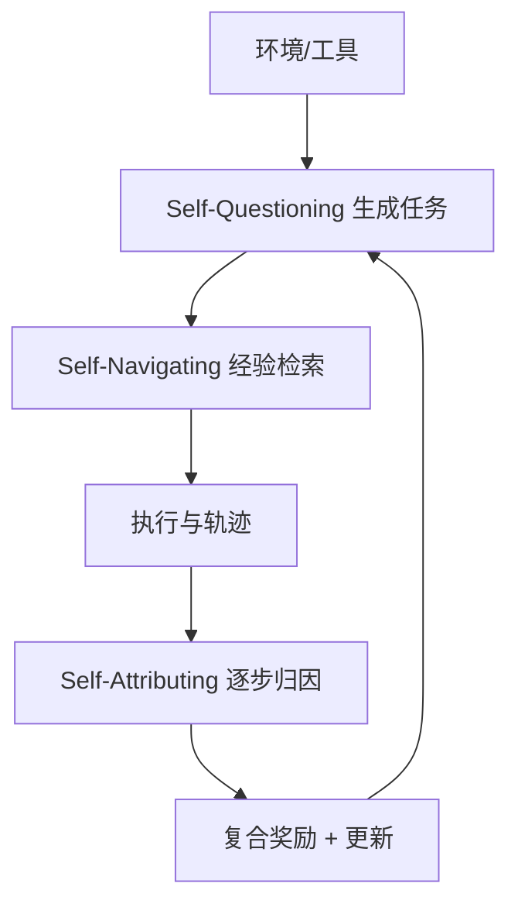

# AgentEvolver：自问题生成 + 经验导航 + 归因奖励的自进化代理

**论文信息**
- 标题: AgentEvolver: Towards Efficient Self-Evolving Agent System
- arXiv: 2511.10395 (2025-11-13 提交)

**摘要提炼**
- 论文提出 AgentEvolver，用“自问题生成(Self-Questioning) + 自导航(Self-Navigating) + 自归因(Self-Attributing)”三机制推动工具代理自进化。
- 目标是降低人工数据依赖与 RL 探索成本，同时提升探索效率与样本利用率。
- 方法在 AppWorld 与 BFCL v3 等工具调用基准上验证，报告了 avg@8、best@8 等核心指标的显著提升。

**问题与动机**
- 工具代理的能力提升通常依赖“人工构造任务 + 高成本 RL 探索”。
- 论文希望通过自动生成任务与经验复用来降低成本，并通过更细粒度奖励提升学习信号。

**方法概览(循序渐进)**
1. **Self-Questioning: 自问题生成**
   - 基于环境画像与已有轨迹，生成新的“自我挑战任务”。
   - 任务经过筛选，形成高质量的探索集合，用于持续扩展训练分布。
2. **Self-Navigating: 经验导航**
   - 建立 Experience Manager，管理任务轨迹、错误模式与可复用提示。
   - 在新任务执行时检索相似经验，提供策略提示或轨迹引导。
3. **Self-Attributing: 细粒度归因奖励**
   - 用 LLM 作为判别器，对每一步行为打“Good/Bad”标签。
   - 将步骤级归因奖励与终局奖励融合，形成可调权重的复合奖励。

**图表：三机制闭环(示意)**

**关键机制拆解**
- **Self-Questioning**
  - 以“好奇驱动”方式生成任务，扩展训练任务分布并减少人工标注。
- **Self-Navigating**
  - 经验库包含成功/失败轨迹与策略提示，支持检索式 ICL 引导。
- **Self-Attributing**
  - 逐步归因奖励由 LLM 判别器输出 Good/Bad。
  - 归因奖励与终局奖励标准化后加权融合，形成复合奖励信号。

**工具、Agent、数据合成、算法创新**
- **工具层**: 面向工具调用任务(如 AppWorld、BFCL v3)，与真实 API/环境交互。
- **Agent 结构**: 引入 Experience Manager 与 Context Manager 形成“长期记忆+轨迹复用”的执行框架。
- **数据合成**: Self-Questioning 自动生成训练任务，减少人工数据依赖。
- **算法创新**: 复合奖励将“过程质量”与“终局结果”统一进 RL 信号。

**Prompt 设计要点**
- 归因奖励通过系统 prompt 约束 LLM 只输出 Good/Bad，保证可直接映射成标量。

**Reward 设计要点**
- 步骤级归因奖励 + 终局奖励 → 标准化后加权融合。
- 引入权重超参，在“过程纠偏”与“最终成功”之间调节学习信号。

**Evaluation Metric 设计**
- **TGC**: Task-level Goal Completion Rate
- **avg@8**: 8 次采样平均表现
- **best@8**: 8 次采样中最佳表现

**实验与结果(简表)**
| 模型 | 指标 | 基线(Qwen2.5) | AgentEvolver | 结论 |
| --- | --- | --- | --- | --- |
| 7B | avg@8 | 15.8 | 45.2 | 明显提升 |
| 7B | best@8 | 24.0 | 60.1 | 明显提升 |
| 14B | avg@8 | 29.8 | 57.6 | 明显提升 |
| 14B | best@8 | 42.8 | 73.1 | 明显提升 |

**局限与讨论**
- 自问题生成的质量高度依赖 LLM 表达与筛选策略。
- 归因奖励由 LLM 判别，可能引入一致性问题或偏差。

**对我的项目的启发(结合 few-shot 策略抽取)**
- 你们的“策略抽取”可以嵌入 Self-Questioning，用自动生成任务不断检验并扩展策略覆盖面。
- Self-Attributing 的步骤级归因可用于“策略执行轨迹”的细粒度评估，让策略优化更精准。

**一句话意义**
- AgentEvolver提供了“任务自动生成 + 经验复用 + 过程归因”的通用升级范式，能为策略抽取型系统提供持续进化的驱动力。

**参考**
- arXiv:2511.10395
