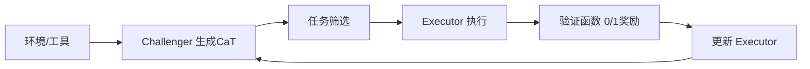

# Self-Challenging Language Model Agents：用Code-as-Task自生成挑战

**论文信息**
- 标题: Self-Challenging Language Model Agents
- arXiv: 2506.01716 (2025-06-02 提交)

**摘要提炼**
- 论文提出 Self-Challenging 框架：让 agent 同时扮演“挑战者(Challenger)”与“执行者(Executor)”。
- Challenger 生成“Code-as-Task”(CaT)格式的任务，包含任务描述、验证函数、参考解与失败样例。
- Executor 在环境中完成任务，并以验证函数输出的 0/1 奖励进行强化学习。
- 该框架只依赖自生成数据，在 M^3ToolEval 与 TauBench 上对 Llama-3.1-8B 实现了显著提升。

**问题与动机**
- 工具调用 agent 的训练常受限于高质量人工任务和验证机制。
- 论文目标是让 agent 自我生成任务并自我验证，从而形成“自挑战-自提升”闭环。

**方法概览(循序渐进)**
1. **Challenger 搜集环境信息**
   - 与工具交互，理解环境与可用 API。
2. **生成 Code-as-Task**
   - 输出包含“任务描述 + 验证函数 + 参考解 + 失败案例”的 CaT 任务。
3. **任务筛选**
   - 过滤掉不可解或过于简单的任务，保留“可解且有挑战性”的任务集合。
4. **Executor 训练**
   - Executor 执行任务，验证函数输出 0/1 奖励。
   - RL 训练等价于对成功轨迹的拒绝式微调(Rejection Fine-Tuning)。

**图表：Self-Challenging 闭环(示意)**

**关键机制拆解**
- **Code-as-Task 格式**
  - CaT 中的验证函数是“可执行代码”，保证奖励自动化。
  - 通过包含参考解和失败案例来控制任务难度与可验证性。
- **任务筛选**
  - 过滤不可解或过于容易的任务，提升训练信号质量。
- **RL 训练策略**
  - 用 0/1 终局奖励训练执行者，并通过 RFT 复用成功轨迹。

**工具、Agent、数据合成、算法创新**
- **工具层**: 依赖可执行环境与工具 API，验证函数在工具环境中运行。
- **Agent 结构**: Challenger 负责生成与验证规则，Executor 专注执行与学习。
- **数据合成**: 任务由 Challenger 自生成，不依赖外部标注。
- **算法创新**: 将任务-评估机制统一编码为“可执行代码”，降低奖励设计成本。

**Prompt 设计要点**
- Challenger 的提示要求生成 `evaluate()` 验证函数，并包含参考解与失败案例，确保可验证性与难度控制。

**Reward 设计要点**
- 终局 0/1 奖励来自验证函数。
- 训练目标可转化为“成功轨迹的拒绝式微调”。

**Evaluation Metric 设计**
- 使用 M^3ToolEval 与 TauBench 等工具调用基准。
- 评价指标包括 pass@1 和 pass@4 等成功率度量。

**实验与结果(重点结论)**
- 在自生成任务训练的设置下，Executor 在多套工具基准上显著提升。
- 报告显示 Llama-3.1-8B 在这些基准上可获得超过 2 倍的提升幅度。

**局限与讨论**
- CaT 任务质量依赖 Challenger 能力，若生成偏差会放大训练噪声。
- 0/1 奖励简洁但稀疏，可能需要与过程性奖励结合以提升学习效率。

**对我的项目的启发(结合 few-shot 策略抽取)**
- 你们项目可以把“策略抽取结果”转化为可执行的验证函数或判别器，用于扩展策略适用范围。
- CaT 的“失败案例”机制非常适合检验策略边界，帮助 few-shot 策略在对抗性挑战中更稳健。

**一句话意义**
- 这篇论文展示了“任务 + 评估规则”一起自生成的闭环思路，可作为你们策略抽取系统的自动扩展与压力测试方案。

**参考**
- arXiv:2506.01716
