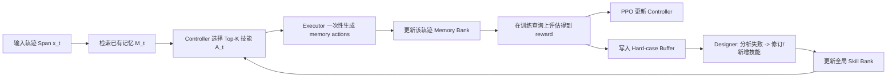

# MemSkill 论文精读：让 Agent 的“记忆操作”从固定规则进化为可学习技能

> 论文：**MemSkill: Learning and Evolving Memory Skills for Self-Evolving Agents**  
> 日期：2026-03-02  
> 目标：这篇笔记只做一件事——**拆解 MemSkill 论文本身**，并评估其对你们“few-shot 提取策略→迁移到新题”项目的可借鉴点。

---

## 0. 先看结论（忙的时候看这个）

- MemSkill 的核心创新不是“又一个 memory 模块”，而是把 memory 操作从 `insert/update/delete/skip` 这类固定流程，升级为**可选择、可组合、可进化**的技能库（skill bank）。
- 方法上是一个闭环：`Controller 选技能 -> Executor 按技能生成记忆 -> Designer 从失败案例进化技能`。
- 论文把 **prompt 设计**、**reward 设计**、**evaluation metric 设计** 都写得比较完整，工程可复现性高。
- 实验覆盖对话长记忆（LoCoMo、LongMemEval）、文档长上下文迁移（HotpotQA）和交互环境（ALFWorld），并展示了跨模型迁移（LLaMA 训练，Qwen 迁移）。
- 对你们项目最有价值的是：**“策略库进化”+“失败样本驱动修订”+“Top-K 组合而非单策略调用”**。

---

## 1. 摘要提炼（按你关心的四个维度）

### 1.1 工具（Tools）

这篇论文的“工具”不是外部 API，而是内部三件套：

1. `Controller`（策略选择器）  
2. `Executor`（LLM 执行器）  
3. `Designer`（失败分析与技能演化器）

此外还用到：
- 向量检索器（默认 Contriever）
- LLM Judge（用于奖励/评估打分）
- 聚类器（KMeans，用于失败样本聚类抽取代表 case）

### 1.2 Agent 设计

它把 agent memory 系统拆成两个“库”：
- `Memory Bank`：每条轨迹私有（trace-specific）
- `Skill Bank`：全局共享、可持续演化

这相当于把“记忆内容”和“记忆方法论”解耦。

### 1.3 数据合成 / 经验构造

论文不是传统“离线标注集”路线，而是：
- 从真实交互轨迹构建 memory 训练过程
- 用下游任务反馈形成 reward
- 收集 hard cases，驱动下一轮技能进化

在 ALFWorld 中还明确采用“双批次机制”：
- Batch A：离线 expert trajectory 用于记忆构建与策略学习
- Batch B：环境执行用于任务反馈与失败采样

### 1.4 算法创新

核心创新有三层：
- **动作空间创新**：动作不是单一 skill，而是“无放回 Top-K 有序技能集”
- **优化目标创新**：给出 Top-K 无放回联合概率，嵌入 PPO
- **系统闭环创新**：用失败样本驱动 skill bank 自进化（可回滚、可早停、可新技能探索偏置）

---

## 2. 方法总览（循序渐进）



### 2.1 Step-1：Controller（技能选择）

对每个 span 构建状态向量 `h_t=f_ctx(x_t, M_t)`，对每个技能描述构建向量 `u_i=f_skill(desc(s_i))`，打分：

\[
z_{t,i}=h_t^\top u_i,\quad p_\theta(i|h_t)=\text{softmax}(z_t)_i
\]

然后从当前技能库里做**无放回 Top-K**选择（有序）：
\[
A_t=(a_{t,1},...,a_{t,K})
\]

> 关键点：这种表示天然兼容“技能库规模变化”，不会像固定分类头那样在新增技能时结构崩掉。

### 2.2 Step-2：Executor（技能条件记忆生成）

Executor 输入三类信息：
- 当前文本 chunk
- 检索到的 memories
- Controller 选出的 skills

输出结构化动作块（INSERT / UPDATE / DELETE），一次 LLM 调用完成一个 span 的记忆更新。

### 2.3 Step-3：Designer（失败驱动技能进化）

Designer 周期性读取 hard cases，先分析失败类型，再提案技能改动：
- refine existing skill
- add new skill
- no change（若主要是 retrieval 问题）

并带有工程护栏：
- best snapshot 回滚
- patience 早停
- 对新技能施加短期探索偏置（前 50 steps）

---

## 3. 关键算法细节（尤其 reward / metric / prompt）

## 3.1 Top-K 无放回联合概率（论文较硬核的点）

Controller 的动作不是单个 skill，而是有序集合。论文给出联合概率：

\[
\pi_\theta(A_t|s_t)=\prod_{j=1}^{K}
\frac{p_\theta(a_{t,j}|s_t)}
{1-\sum_{\ell<j}p_\theta(a_{t,\ell}|s_t)}
\]

然后直接替换进 PPO 的 importance ratio 与 clipped objective 中。

这点很重要：它让“组合策略选择”有了严格可训练目标，而不是启发式抽样。

## 3.2 Reward 设计

- episode-level reward 来自记忆依赖任务评分（如 F1 或 success rate）
- 默认是“末端奖励”（memory 构建完后才给）
- 论文实现里还引入稳定化策略：用每轮训练后四分之一阶段的均值作为演化判断分数，降低波动误判

hard case 难度分数：
\[
d(q)=(1-r(q))\cdot c(q)
\]
其中 `r(q)` 是奖励，`c(q)` 是失败累计次数。

## 3.3 Evaluation Metric 设计

对话类：
- `F1`
- `L-J`（LLM Judge Score，0/0.5/1）

交互环境（ALFWorld）：
- `SR`（success rate）
- `#Steps`（步数，越低越好）

## 3.4 Prompt 设计（论文给了完整模板）

重点不是“花哨措辞”，而是**结构约束**：
- Executor 强制输出 action block，避免自由文本污染解析
- Designer 分两阶段（分析 -> 改写），都强制 JSON 输出，降低格式噪声
- LLM Judge 统一 3 档分数，保证奖励离散且可比较

可借鉴的一点：他们把“模型主观判断”压进了可解析结构，利于自动化闭环训练。

---

## 4. 实验设置与数据（你关心的数据合成/构建）

### 4.1 数据集与任务类型

- LoCoMo：长对话记忆问答
- LongMemEval-S：超长对话（~100K tokens），用于跨数据集迁移评估
- HotpotQA（50/100/200 docs）：用于分布偏移迁移评估
- ALFWorld：交互式 embodied 任务

### 4.2 关键实现参数（论文+代码）

- 训练时常用 `K=3`；评估时对话任务常用 `K=7`，ALFWorld 常用 `K=5`
- 检索上限多设为 Top-20 memory
- 默认 retriever：Contriever
- 技能进化频率：每 100 步触发一次
- 每轮最多 3 个 skill 修改

---

## 5. 主要结果（含具体数字）

### 5.1 主表结果（Main Comparison）

| 模型块 | 任务 | MemSkill | 代表强基线 | 结论 |
|---|---:|---:|---:|---|
| LLaMA | LoCoMo L-J | **50.96** | A-MEM 46.34 / MemoryOS 44.59 | 明显领先 |
| LLaMA | LongMemEval L-J | **59.41** | CoN 56.93 | 迁移下仍领先 |
| LLaMA | ALF-Seen SR | **47.86** | CoN 40.71 | 显著提升 |
| LLaMA | ALF-Unseen SR | **47.01** | ReadAgent 38.06 | 泛化提升 |
| Qwen(迁移) | LoCoMo L-J | **52.07** | A-MEM 48.41 | 跨模型迁移成立 |
| Qwen(迁移) | LongMemEval L-J | **59.90** | CoN 46.04 | 大幅领先 |
| Qwen(迁移) | ALF-Seen SR | **60.00** | CoN 57.86 | 稳定领先 |
| Qwen(迁移) | ALF-Unseen SR | **64.18** | CoN 53.73 | 领先明显 |

> 解释：Qwen 块标记为迁移评估（未在该模型上再训练），说明 skill bank 具备跨模型可迁移性。

### 5.2 消融结果（LoCoMo L-J）

| 变体 | LLaMA | Qwen |
|---|---:|---:|
| MemSkill 默认 | **50.96** | **52.07** |
| 去 Controller（随机选技能） | 45.86 | 41.24 |
| 去 Designer（静态四原语） | 44.11 | 34.71 |
| 仅 refine 不增新技能 | 44.90 | 46.97 |

结论很直接：
- 仅“会选技能”不够，**技能本身的进化**是核心增益源之一
- 只 refine 不 add new，也不如完整方案

### 5.3 分布偏移（HotpotQA）

论文展示：从 LoCoMo 学到的技能库直接迁移到 HotpotQA（50/100/200 文档长度），均优于 MemoryOS / A-MEM，且长上下文场景优势更明显；`K=7`普遍最好。

---

## 6. 从 Agent 工程视角看：这篇论文真正贡献了什么？

### 6.1 把“记忆模块”变成“策略系统”

过去：手工规则 + 固定流程  
现在：可学习策略 + 可进化技能库 + 自动失败归因

### 6.2 把“失败样本”升级为一等训练资源

不是简单统计错误率，而是：
- 聚类找失败类型
- 结构化归因（storage/retrieval/memory quality）
- 输出可执行技能变更

### 6.3 把“提示词工程”转成“协议工程”

Prompt 在这里不是临时调参，而是完整协议：
- 输入字段固定
- 输出格式固定
- 决策与评估统一 JSON 化

这对自动化训练闭环非常关键。

---

## 7. 局限与风险（落地前要看到）

- `L-J` 作为奖励可能引入 judge 偏差；若 judge 风格漂移，训练信号会变形。
- Skill bank 增长后可能出现“冗余技能/语义重叠技能”，需要额外去重与压缩机制。
- 分布偏移实验虽强，但主要仍在“文本记忆”相关任务，超复杂工具链任务上还需验证。
- 该体系工程复杂度高于普通 memory baseline，涉及多组件协同和稳定性监控。

---

## 8. 对你们项目的启发（few-shot 提取策略 -> 迁移新问题）

你们当前范式是：从 few-shot 示例中提取解题策略，再迁移到新题。  
MemSkill 可直接给出一个“可进化策略系统”的升级路径：

1. **把策略显式化为技能对象**（描述 + 适用条件 + 执行动作约束）  
2. **从单策略调用改为 Top-K 策略组合**（应对复杂题多因素耦合）  
3. **把失败新题沉淀成 hard cases**，做周期性“策略增改”而非只重训模型  
4. **引入策略采用率与增量收益监控**，避免策略库越长越乱

一个可直接迁移到你们场景的最小闭环：

```text
few-shot 抽取初始策略库
-> 策略选择器（按题目状态选 Top-K）
-> 执行器（按策略生成解题过程）
-> 评估器（答案+过程）
-> 失败聚类与归因
-> 策略库 refine / add-new
```

### 一两句话总结其对你们项目的意义

MemSkill 的意义在于：它把“策略迁移”从一次性提取，升级为**可持续演化的策略操作系统**。  
你们最可参考的是“Top-K 策略组合 + 失败驱动策略进化 + 结构化评估反馈”这三件套。

---

## 参考链接

- 论文主页（arXiv）：[https://arxiv.org/abs/2602.02474](https://arxiv.org/abs/2602.02474)
- 论文代码仓库：[https://github.com/ViktorAxelsen/MemSkill](https://github.com/ViktorAxelsen/MemSkill)
