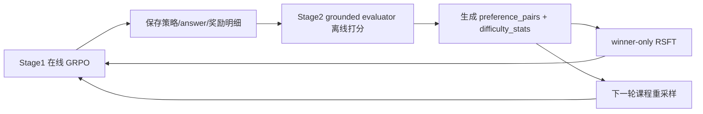

# 替代升级计划：三环结构 + v2-lite + grounded proxy + RSFT + curriculum

## 简要结论

Cursor 这份蓝图方向是对的，尤其抓住了四个真问题：`策略表示太松`、`reward 过度依赖 scorer`、`没有课程`、`没有负例闭环`。  
但它的主要问题是：**把 5 件高耦合的事一次性塞进现有训练回路里**，而你当前代码并不支持这种接法。更稳、更快的路径不是“直接上结构化 JSON + 在线 pairwise + 在线 KTO + 在线课程 + SR 预热”，而是：

1. 先用你现有的 `stage1 + stage2` 管线把“策略是否真的可用”测清楚。  
2. 再把策略输出升级成**轻量结构化 IR**，而不是一开始就上重 JSON。  
3. 在线训练只做一件事：`scorer + grounded proxy` 的混合 reward。  
4. pairwise、负例学习、课程学习全部放到**外环**做，不要硬塞进单个 rollout。  
5. 第一轮不要上 KTO，先做 `winner-only RSFT`，更可落地。

---

## 主要问题（按严重级别排序）

### 1. 高严重：课程学习接入点设计错误，按当前代码不会生效

问题定位：  
[2026-02-28-项目升级蓝图-结构化策略+双奖励+课程学习.md:635](/home/test/test16/chenlu/projects/agent-lightning/plan/2026-02-28-项目升级蓝图-结构化策略+双奖励+课程学习.md:635)  
[2026-02-28-项目升级蓝图-结构化策略+双奖励+课程学习.md:646](/home/test/test16/chenlu/projects/agent-lightning/plan/2026-02-28-项目升级蓝图-结构化策略+双奖励+课程学习.md:646)  
[train_strategy_generation.py:393](/home/test/test16/chenlu/projects/agent-lightning/examples/strategy_extraction/train_strategy_generation.py:393)  
[train_strategy_generation.py:484](/home/test/test16/chenlu/projects/agent-lightning/examples/strategy_extraction/train_strategy_generation.py:484)

原因：  
当前训练集是在 `trainer.fit()` 之前一次性生成好的。蓝图里说“rollout 后 tracker.update，再影响采样”，但当前实现里 rollout 期间已经不会再重新采样数据了，所以这个 DifficultyTracker 即使更新，也**不会改变当前训练轮的数据分布**。

结论：  
课程学习不能以内存 tracker 的形式直接嵌进当前 `fit()`。必须改成**外环 dataset regeneration**，即“训练一轮 -> 评估 -> 更新 difficulty stats -> 重建下轮数据 -> resume 训练”。

### 2. 高严重：`GRPO + KTO` 在同一主回路里不可直接实现

问题定位：  
[2026-02-28-项目升级蓝图-结构化策略+双奖励+课程学习.md:111](/home/test/test16/chenlu/projects/agent-lightning/plan/2026-02-28-项目升级蓝图-结构化策略+双奖励+课程学习.md:111)  
[2026-02-28-项目升级蓝图-结构化策略+双奖励+课程学习.md:652](/home/test/test16/chenlu/projects/agent-lightning/plan/2026-02-28-项目升级蓝图-结构化策略+双奖励+课程学习.md:652)  
[2026-02-28-项目升级蓝图-结构化策略+双奖励+课程学习.md:887](/home/test/test16/chenlu/projects/agent-lightning/plan/2026-02-28-项目升级蓝图-结构化策略+双奖励+课程学习.md:887)  
[strategy_generation_agent.py:493](/home/test/test16/chenlu/projects/agent-lightning/examples/strategy_extraction/strategy_generation_agent.py:493)  
[strategy_generation_agent.py:617](/home/test/test16/chenlu/projects/agent-lightning/examples/strategy_extraction/strategy_generation_agent.py:617)

原因：  
当前 `rollout_async()` 的契约非常清楚：一条 rollout 产生一个 traced strategy，一个标量 reward，然后 `emit_reward(final_reward)`。  
KTO 需要的是单独的 preference / desirable-undesirable 训练回路、checkpoint 格式、数据读取器、训练器切换、以及和 VERL checkpoint 的兼容方案。蓝图里提到 `kto_finetune.py`，但没有定义：

1. 它读取什么格式的 checkpoint。  
2. 它输出什么格式的 checkpoint。  
3. 这个输出如何回灌给 VERL 继续训练。  
4. 训练 tokenizer / prompt 模板是否一致。  

结论：  
KTO 不能作为第一轮主线。第一轮用 `winner-only RSFT` 代替，等 preference 数据稳定之后再考虑 KTO。

### 3. 高严重：结构化策略方案太重，不适合第一步上线

问题定位：  
[2026-02-28-项目升级蓝图-结构化策略+双奖励+课程学习.md:163](/home/test/test16/chenlu/projects/agent-lightning/plan/2026-02-28-项目升级蓝图-结构化策略+双奖励+课程学习.md:163)  
[2026-02-28-项目升级蓝图-结构化策略+双奖励+课程学习.md:186](/home/test/test16/chenlu/projects/agent-lightning/plan/2026-02-28-项目升级蓝图-结构化策略+双奖励+课程学习.md:186)  
[strategy_application/reward.py:100](/home/test/test16/chenlu/projects/agent-lightning/examples/strategy_application/reward.py:100)  
[strategy_application/reward.py:132](/home/test/test16/chenlu/projects/agent-lightning/examples/strategy_application/reward.py:132)

原因：  
蓝图直接上 JSON schema，字段很多：`constraint_recognition / rationale / branch_rules / self_check / fallback`。这会带来三个问题：

1. RL 初期格式失败率会高。  
2. token 长度变长，stage1 prompt / response 更容易不稳。  
3. 你现有 stage2 的 reward 已经能消费“编号步骤文本”，不需要先升级到完整 JSON 才能做步骤级信号。  

结论：  
第一步应该用**轻量结构化 IR**，不是 JSON。推荐“有 section header 的纯文本 schema”，这样能最大化复用当前 stage2 的 step parser。

### 4. 中严重：把 `correctness-weight=0` 诊断成“完全闲置”并不准确

问题定位：  
[2026-02-28-项目升级蓝图-结构化策略+双奖励+课程学习.md:31](/home/test/test16/chenlu/projects/agent-lightning/plan/2026-02-28-项目升级蓝图-结构化策略+双奖励+课程学习.md:31)  
[2026-02-28-项目升级蓝图-结构化策略+双奖励+课程学习.md:46](/home/test/test16/chenlu/projects/agent-lightning/plan/2026-02-28-项目升级蓝图-结构化策略+双奖励+课程学习.md:46)  
[strategy_generation_agent.py:444](/home/test/test16/chenlu/projects/agent-lightning/examples/strategy_extraction/strategy_generation_agent.py:444)  
[strategy_generation_agent.py:469](/home/test/test16/chenlu/projects/agent-lightning/examples/strategy_extraction/strategy_generation_agent.py:469)

原因：  
当前 stage1 在配置了 `answer_model_base_url` 的情况下，**仍然会跑 answer model 并记录 correctness**，只是 correctness 不进入最终 reward。  
所以当前系统不是“完全没有 correctness 信号”，而是“**已有 correctness 观测，但尚未校准到 reward**”。

结论：  
第一步不应直接把 correctness 权重抬到 `0.5`。正确顺序是：

1. 先分析 `scorer vs correctness` 的相关性。  
2. 再决定是否把 correctness 纳入在线 reward。  
3. 否则你会把 stage1 目标从“抽策略”偷换成“迎合 frozen answer model”。

### 5. 中严重：蓝图忽略了现有 stage2 的 grounded 评估能力，重复造轮子

问题定位：  
[2026-02-28-项目升级蓝图-结构化策略+双奖励+课程学习.md:349](/home/test/test16/chenlu/projects/agent-lightning/plan/2026-02-28-项目升级蓝图-结构化策略+双奖励+课程学习.md:349)  
[2026-02-28-项目升级蓝图-结构化策略+双奖励+课程学习.md:434](/home/test/test16/chenlu/projects/agent-lightning/plan/2026-02-28-项目升级蓝图-结构化策略+双奖励+课程学习.md:434)  
[strategy_application/reward.py:132](/home/test/test16/chenlu/projects/agent-lightning/examples/strategy_application/reward.py:132)  
[strategy_application/reward.py:171](/home/test/test16/chenlu/projects/agent-lightning/examples/strategy_application/reward.py:171)  
[strategy_application/reward.py:218](/home/test/test16/chenlu/projects/agent-lightning/examples/strategy_application/reward.py:218)

原因：  
stage2 现有 reward 已经有：

1. step coverage  
2. order consistency  
3. entity binding  
4. intermediate consistency  
5. correctness  

这些本来就是“低成本 grounded proxy”。蓝图却另起一套 `step_credit.py` 和 `first_error_step`，这会让系统多一套判断器、多一套误差源。

结论：  
第一轮不要新造 step-level LLM judge。先直接把 stage2 reward 函数复用进 stage1 的 offline audit 和 grounded proxy。

### 6. 中严重：对跨域能力的诊断不准确

问题定位：  
[2026-02-28-项目升级蓝图-结构化策略+双奖励+课程学习.md:99](/home/test/test16/chenlu/projects/agent-lightning/plan/2026-02-28-项目升级蓝图-结构化策略+双奖励+课程学习.md:99)  
[strategy_application/README.md](/home/test/test16/chenlu/projects/agent-lightning/examples/strategy_application/README.md)  
[strategy_application/data_loader.py:215](/home/test/test16/chenlu/projects/agent-lightning/examples/strategy_application/data_loader.py:215)

原因：  
项目并不是“没有跨域机制”，而是**stage2 已有 cross_domain 模式，stage1 没有把跨域能力显式纳入训练闭环**。

结论：  
更准确的升级点应是：先把 stage1 产出的策略用 stage2 cross_domain 模式评测，再决定是否为 stage1 增加 source-target curriculum。

### 7. 低严重：文档溯源不一致

问题定位：  
[2026-02-28-项目升级蓝图-结构化策略+双奖励+课程学习.md:4](/home/test/test16/chenlu/projects/agent-lightning/plan/2026-02-28-项目升级蓝图-结构化策略+双奖励+课程学习.md:4)

原因：  
文档写“综合 8 篇论文”，但当前 `paper/` 目录里可追溯的是 7 篇，而且没有 `AgentEvolver` 文档。

结论：  
需要把背景来源和实际输入对齐，否则后续方案归因会变糊。

---

## 替代方案总览

### 目标

把当前项目升级成一个**三环结构**，而不是一锅炖：

1. `在线主环`：继续用现有 VERL/GRPO 训练 stage1，但 reward 只做小幅升级。  
2. `离线评估环`：复用 stage2 reward，把策略的“可执行性”测清楚。  
3. `外环数据环`：基于离线评估结果做 preference mining、winner-only distill、课程重采样。  

这个结构的优点是：

1. 不改 AGL/VERL 核心。  
2. 不需要在 rollout 里多塞 3 个 LLM judge。  
3. 可以逐轮验证每个模块是否真有增益。  
4. 失败了可以单独回滚某一环，不会全盘爆炸。  

---

## 推荐架构



---

## 公共接口 / 类型 / 产物变更

### 1. 策略中间表示：`StrategyIR v2-lite`

新策略格式不使用 JSON，使用轻量 section schema：

```text
<strategy>
TYPE: <short task pattern label>

STEPS:
1. ...
2. ...
3. ...

CHECK:
- ...

FALLBACK:
- ...
</strategy>
```

默认要求：

1. `TYPE` 必填，1 行。  
2. `STEPS` 必填，3-6 步。  
3. `CHECK` 必填，1-2 条。  
4. `FALLBACK` 可选。  

原因：

1. 兼容现有 `strategy_application/reward.py` 的 step parsing。  
2. 比 JSON 更稳。  
3. 仍然足以支撑 step-level proxy。  

### 2. 新增解析类型

新增 `StrategyIR`：

```python
class StrategyIR(TypedDict):
    type: str
    steps: list[str]
    checks: list[str]
    fallback: list[str]
```

兼容规则：

1. v2-lite 解析成功则优先使用。  
2. v2-lite 失败则回退到 v1 的自由文本 `extract_strategy()`。  
3. stage2 reward 支持同时消费 v1/v2-lite。  

### 3. 新增离线评估产物

#### `strategy_eval.jsonl`

字段固定为：

```json
{
  "sample_key": "...",
  "problem_type": "...",
  "strategy_text": "...",
  "strategy_format": "v1|v2_lite",
  "scorer_score": 0.0,
  "correctness": 0.0,
  "coverage": 0.0,
  "order": 0.0,
  "binding": 0.0,
  "intermediate": 0.0,
  "grounded_proxy": 0.0,
  "final_online_reward": 0.0
}
```

#### `preference_pairs.jsonl`

字段固定为：

```json
{
  "sample_key": "...",
  "problem_type": "...",
  "winner_strategy": "...",
  "loser_strategy": "...",
  "winner_grounded_proxy": 0.0,
  "loser_grounded_proxy": 0.0,
  "margin": 0.0
}
```

#### `difficulty_stats.json`

字段固定为：

```json
{
  "problem_type_a": {
    "ema_success": 0.43,
    "n_obs": 120,
    "sampling_weight": 0.86
  }
}
```

### 4. 新增 CLI / 配置项

必须新增这些配置，不留给实现者决定：

1. `--strategy-prompt-version v2_lite`
2. `--reward-mode scorer_only|hybrid_grounded`
3. `--grounded-proxy-weight 0.3`
4. `--export-eval-jsonl true|false`
5. `--difficulty-stats-path <path>`
6. `--curriculum-rounds <int>`
7. `--total-epochs <int>`
8. `--round-max-steps <int>` 或直接通过 `total_epochs=1` 外环控制
9. `--preference-margin-threshold 0.25`
10. `--winner-distill-anchor-ratio 0.1`

默认值：

1. `reward-mode=scorer_only` 初始。  
2. 通过 audit gate 后切换到 `hybrid_grounded`。  
3. `grounded-proxy-weight=0.3`。  
4. `preference-margin-threshold=0.25`。  
5. `winner-distill-anchor-ratio=0.1`。  

---

## 详细实施计划

### Phase 0：先做离线审计，不改训练目标

#### 目标

判断当前 scorer 是否真的和“策略可执行性”对齐。

#### 需要做的事

1. 新建 `analysis/analyze_strategy_reward_alignment.py`。  
2. 读取现有 stage1 validation outputs / rollout traces。  
3. 复用 [reward.py](/home/test/test16/chenlu/projects/agent-lightning/examples/strategy_application/reward.py) 里的：  
[compute_step_coverage](/home/test/test16/chenlu/projects/agent-lightning/examples/strategy_application/reward.py:132)  
[compute_step_order_consistency](/home/test/test16/chenlu/projects/agent-lightning/examples/strategy_application/reward.py:171)  
[compute_entity_binding_consistency](/home/test/test16/chenlu/projects/agent-lightning/examples/strategy_application/reward.py:218)  
以及 correctness，计算 grounded proxy。  
4. 输出以下统计：
- global Pearson/Spearman(`scorer_score`, `correctness`)
- per-problem-type Spearman
- `strategy length` 与 `correctness` 的相关性
- parse rate
- grounded proxy 分布
- top scorer bin 的真实 correctness

#### Grounded proxy 定义

固定为：

\[
grounded\_proxy = 0.6 \cdot correctness + 0.2 \cdot coverage + 0.1 \cdot order + 0.1 \cdot binding
\]

额外规则：

1. 若 `correctness == 0` 且 `coverage < 0.4`，则 `grounded_proxy = min(grounded_proxy, 0.2)`。  
2. `intermediate` 只做分析，不先进入主 reward。  

#### 决策门槛

1. 若 global Spearman(`scorer`, `correctness`) `< 0.35`，则**不修改在线 reward 权重**。  
2. 若 `>= 0.35`，进入 Phase 2。  
3. 若 top scorer bin (`score > 0.8`) 的 correctness `< 0.5`，说明存在明显 reward hacking 风险，必须先做 representation 改造。  

### Phase 1：把策略输出升级为 `v2-lite`，不碰 RL 算法

#### 目标

让策略变得“可解析、可比较、可复用”，但保持生成稳定。

#### 需要做的事

1. 新建 `examples/strategy_extraction/prompt/strategy_generation/v2_lite.toml`。  
2. 在 `reward/` 包里新增 `parse_strategy_ir()`。  
3. 保持 `extract_strategy()` 作为 fallback。  
4. 更新 stage1 format reward：
- 完全符合 v2-lite：`1.0`
- 仅有 `<strategy>` 标签但没解析成功：`0.3`
- 无标签：`0.0`

#### 不做的事

1. 不上 JSON schema。  
2. 不在这个阶段上 pairwise。  
3. 不改 scorer prompt。  

#### 验收

1. v2-lite parse rate `> 95%`。  
2. 平均 response token 相比 v1 增加不超过 `15%`。  
3. correctness 不低于 v1 基线超过 `2%`。  

### Phase 2：在线 reward 升级为 `hybrid_grounded`，但只做一小步

#### 目标

把 stage1 reward 从“纯 scorer”升级为“scorer + grounded proxy”，避免策略朝 frozen answer model 过拟合。

#### 在线 reward 方案

若 Phase 0 通过门槛，则启用：

\[
R = 0.1 \cdot format + 0.6 \cdot scorer + 0.3 \cdot grounded\_proxy
\]

其中 `grounded_proxy` 使用 Phase 0 同一公式，且直接在 `strategy_generation_agent.py` 内复用 stage2 reward 函数计算，不新增 LLM 调用。

若 Phase 0 未通过门槛，则保持：

\[
R = 0.1 \cdot format + 0.9 \cdot scorer
\]

但持续记录 `grounded_proxy` 供后续 scorer 重训使用。

#### 必须修改的地方

1. 在 [strategy_generation_agent.py](/home/test/test16/chenlu/projects/agent-lightning/examples/strategy_extraction/strategy_generation_agent.py) 中，answer_output 已存在，无需额外采样次数改造。  
2. 在 `reward_details` 中新增：
- `coverage`
- `order`
- `binding`
- `grounded_proxy`
- `reward_mode`

#### 明确不做的事

1. 不把 `correctness-weight` 直接改成 `0.5`。  
2. 不做 `K=4` answer sampling。第一轮不加计算成本。  

#### 验收

1. `Spearman(final_online_reward, grounded_proxy)` 比 baseline 提升至少 `+0.15`。  
2. `val grounded_proxy` 提升至少 `5%`。  
3. `val correctness` 不下降。  

### Phase 3：离线 preference mining，不做在线 pairwise

#### 目标

得到真正有用的“好策略 vs 坏策略”数据，但不破坏当前 rollout 契约。

#### 为什么不做在线 pairwise

因为当前 rollout 是单策略单 reward，硬塞两条策略 A/B 会显著改动 traced generation、日志结构和 RL 目标，而且与 [strategy_generation_agent.py:395](/home/test/test16/chenlu/projects/agent-lightning/examples/strategy_extraction/strategy_generation_agent.py:395) 到 [strategy_generation_agent.py:509](/home/test/test16/chenlu/projects/agent-lightning/examples/strategy_extraction/strategy_generation_agent.py:509) 的现有实现冲突。

#### 正确做法

1. 给每个 rollout 增加 `sample_key`：
   - `sample_key = sha1(problem_type + problem + fewshot_examples_serialized)`
2. 从同一个 `sample_key` 下的多条策略里离线比较。  
3. 去重规则：
   - `normalized_strategy_text` 相同则视为同一候选。  
4. preference pair 采样规则：
   - `winner.grounded_proxy - loser.grounded_proxy >= 0.25`
   - `winner.correctness >= loser.correctness`
   - 每个 `sample_key` 最多保留 `top1 vs bottom1` 一对

#### 第一轮训练方式

**默认用 winner-only RSFT，不上 KTO。**

原因：

1. 仓库已有 SFT 能力可复用，例如 [sft_algorithm.py](/home/test/test16/chenlu/projects/agent-lightning/examples/unsloth/sft_algorithm.py)。  
2. RSFT 不需要另一个 preference trainer 栈。  
3. 更容易和现有 checkpoint 接起来。  

#### RSFT 数据构成

1. `90%` winner strategies  
2. `10%` anchor 数据（原始 v1/v2 高质量 few-shot 提取样本）  

#### 验收

1. RSFT 后，`val grounded_proxy` 提升至少 `3%`。  
2. `OOD correctness` 不下降超过 `2%`。  
3. 若连续两轮无提升，再考虑 DPO/KTO，不在本轮计划内。  

### Phase 4：课程学习改成外环 round-based 训练

#### 目标

让课程学习真正影响采样，而不是做无效 tracker。

#### 训练外环设计

新建 `train_generation_curriculum.py`，round 结构固定为：

1. 读取 `difficulty_stats.json`  
2. 按权重生成新一轮 train dataset  
3. 调用 `train_strategy_generation.py` 训练 `1 epoch`  
4. 跑 validation  
5. 用 validation 中的 `grounded_proxy` 更新 `difficulty_stats.json`  
6. resume 到下一 round  

#### 采样权重公式

固定为：

\[
w(p)=\max(0.15, 1 - 2|p-0.5|)
\]

其中 `p` 是该 `problem_type` 最近一轮的 `ema_success`。

#### `difficulty_stats` 更新规则

1. `ema_success_new = 0.7 * ema_success_old + 0.3 * round_success`  
2. 冷启动时所有题型初始化为 `0.5`  
3. 若某题型 `n_obs < 20`，不降权，只做记录  

#### round 配置

1. `curriculum_rounds = 4`  
2. 每 round：`total_epochs = 1`  
3. 每 round 训练样本数：保持不变  
4. 每 round 结束必须保存：
- checkpoint
- `strategy_eval.jsonl`
- `difficulty_stats.json`

#### 验收

1. 边界难度题型（`0.3 <= p <= 0.7`）的采样占比 > `50%`  
2. OOD 指标不低于无课程版本  
3. 若课程导致 ID 提升但 OOD 下滑 > `3%`，回退到上一 round stats  

### Phase 5：创新支线，只在主线稳定后开启

#### 支线 A：Grounded Self-Reflection 预热

只在 Phase 3 preference pairs 足够多时开启。

规则：

1. 仅使用 `margin >= 0.3` 的 winner/loser pair  
2. 让模型生成一段短 reflection，解释 winner 为什么优于 loser  
3. reflection 不进入在线 reward，只进入离线 SFT 数据  

目的：

1. 学“策略选择原则”  
2. 不污染在线 RL 信号  

#### 支线 B：Specialist -> Generalist

只在 OOD 确认成为主瓶颈时开启。

规则：

1. 先按 `problem_type cluster` 训专家 extractor  
2. 用 winner-only RSFT 蒸馏到通用 extractor  
3. 通才阶段再走 Phase 2-4 流程  

#### 支线 C：Task mutation

借鉴 DreamGym / SPICE，但只做**模板化题目变体生成**，不做全 synthetic world model。  
这是创新选项，不是主线必需项。

---

## 文件与实现范围

### 只改这些目录

1. `examples/strategy_extraction/`  
2. `examples/strategy_application/`  
3. `analysis/`  
4. `plan/` 文档同步更新  

### 明确不改

1. `agentlightning/` 核心  
2. `VERL` 核心算法实现  
3. Store / tracer / adapter 核心  

---

## 测试与验收场景

### 单元测试

1. `parse_strategy_ir()`：
- 正常 v2-lite
- 缺少 CHECK
- STEPS 少于 3
- 仍然兼容 v1
2. grounded proxy：
- correctness=1 时分数必须高于 correctness=0
- coverage/order/binding 单独变化时分数单调
3. preference miner：
- 相同 `sample_key` 分组正确
- 重复策略去重正确
- margin 阈值正确生效
4. difficulty stats：
- `ema_success` 更新正确
- `w(p)` 在 `p=0.5` 最大
- `p=0`/`1` 时不低于 `0.15`

### 集成测试

1. 小数据 smoke test：
- 3 个 `problem_type`
- 每类 20 个样本
- 完成 stage1 训练 + audit + preference mining
2. backward compatibility：
- `strategy_prompt_version=v1` 时旧流程不崩
3. reward mode switch：
- `scorer_only`
- `hybrid_grounded`
都能跑通

### 实验对照

固定四个 baseline，不允许临时增加：

1. Baseline A：当前 `v2 scorer-only`
2. Baseline B：`v2-lite + scorer-only`
3. Baseline C：`v2-lite + hybrid_grounded`
4. Ours：`v2-lite + hybrid_grounded + RSFT + curriculum`

统一报告四个指标：

1. ID correctness
2. OOD correctness
3. grounded proxy
4. scorer-correctness correlation

---

## 默认选择与假设

1. 默认第一轮不做 KTO。  
2. 默认不做在线 pairwise。  
3. 默认不做 JSON schema，先做 `v2-lite` section schema。  
4. 默认课程学习放到 round-based 外环。  
5. 默认使用现有 stage2 reward 作为 grounded proxy，不新增 LLM step judge。  
6. 默认继续使用 frozen answer model，与训练模型分离。  
7. 默认 stage1 先做 same-domain 优化，cross-domain 作为 stage2 评测与后续增量方向。  
8. 默认所有新增模块都必须能通过 flag 关闭，保证 A/B 对照。
